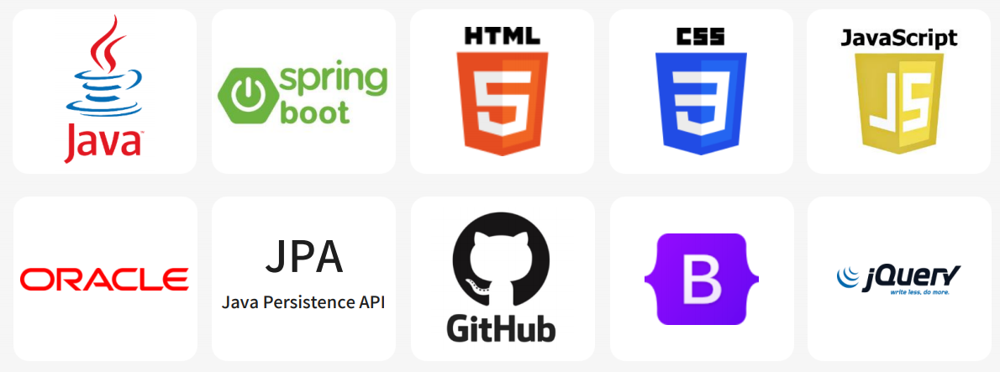
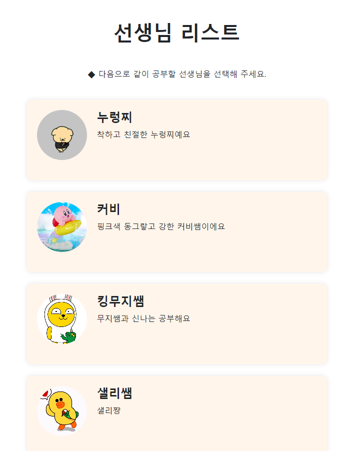
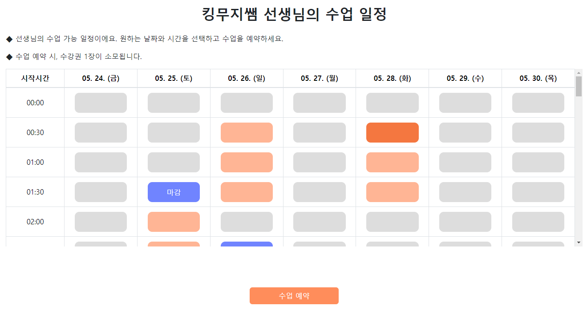

# TalkToJP


## 목차
1. [프로젝트 설명](#1-프로젝트-설명)
2. [필수 요구 사항](#2-필수-요구-사항)
3. [환경 설정](#3-환경-설정sts4-또는-eclipse-기준)
4. [상세 설명](#4-상세-설명)

    - [프로젝트 개요](#프로젝트-개요)
        - 개발 주제 & 기간
        - 주제를 선택한 이유 & 프로젝트 목표
        - 사용 기술
    - [프로젝트 계획](#프로젝트-계획)
        - 요구사항 정의서
        - DB ER 다이어그램
    - [프로젝트 예시](#프로젝트-예시)
    - [마무리](#마무리)
        - 느낀 점 & 아쉬웠던 점


## 1. 프로젝트 설명

TalkToJP는 1:1 온라인 수업 플랫폼으로, 선생님과 학생이 자유로운 시간에 수업을 진행할 수 있도록 합니다. 주요 기능으로 1:1 채팅 기능이 포함되어 있어, 외부 메신저 없이도 웹 애플리케이션 내에서 연락이 가능합니다.

## 2. 필수 요구 사항

- Java 17 이상
- Oracle 11g 이상

## 3. 환경 설정(STS4 또는 Eclipse 기준)

__1. lombok plugin 설치__

   1)　플러그인 다운로드
   
    https://projectlombok.org/download
   

   2)　내려받은 jar파일을 더블클릭하여 실행하거나, 명령 프롬프르(CMD)에 다음과 같이 입력합니다.
    ```sh
    java -jar lombok.jar
    ```
   3)　[Specify location]을 클릭해 롬복 플러그인을 사용할 IDE가 설치된 경로를 선택하고, [Install / Update]를 클릭해 롬복 플러그인을 설치합니다.

   4)　build.gradle에 의존성을 추가합니다.


    ```sh
    dependencies {
    compileOnly 'org.projectlombok:lombok' //추가
    annotationProcessor 'org.projectlombok:lombok' // 추가
    }
    ```
    
__2. 파일 업로드 후 새로고침 되도록 설정__

   
   

   
     파일 업로드 후 프로젝트 내부에 파일이 저장되는 경우, Eclipse에서 파일 시스템 변경을 감지하고 새로고침하여 변경 사항이 즉시 반영됩니다.

## 4. 상세 설명

### 프로젝트 개요

- 개발 주제 & 기간
  - **개발 주제**: 자유로운 시간 운용이 가능한 1:1 온라인 수업 플랫폼
  - **개발 기간**: 2024-05-01 ~ 2024-05-21 (20일)
  - **개발 인원**: 1인 단독 개발

- 주제를 선택한 이유 & 프로젝트 목표
  - **주제를 선택한 이유**: 최초로 제작한 프로젝트가 쇼핑몰 프로젝트였기 때문에 이번 프로젝트에서는 쇼핑몰과 다른 분야의 웹 애플리케이션으로 개발하고 싶었습니다. 마침 1:1 채팅 기능을 구현해보고 싶었는데, 채팅 기능을 사용하기에 알맞은 주제라고 생각하여 결정하게 되었습니다.
  - **프로젝트 목표**: 
    - 선생님은 원하는 시간에 자신의 클래스를 열고, 학생은 원하는 시간대에 원하는 선생님의 수업을 신청하여 선생님과 학생 모두 자유로운 시간 운용이 가능해야 함
    - 1:1 채팅 기능을 구현하여 외부 메신저에 의존하지 않고 웹 애플리케이션 자체적으로 학생과 선생님 간의 연락이 가능하여야 함

- 사용 기술


### 프로젝트 계획

- 요구사항 정의서

- DB ER 다이어그램


### 프로젝트 예시

- 로그인 & 회원가입


<br>

- 메인화면
  - 로그인하지 않은 경우


<br><br>

  - 로그인한 경우


<br>

- 학생 전용 기능





<br>

- 선생님 전용 기능


<br>

- 공통 기능


### 마무리

- 느낀 점 & 아쉬웠던 점
  - **느낀 점**: 1인 개발로 시작했기 때문에 프론트 엔드부터 백엔드까지 모든 작업을 혼자 해내야 했던 부분이 있었습니다. 작업이 부담되기는 했지만, 덕분에 다양한 방면으로 많은 것을 배울 수 있었다고 생각합니다.
  - **아쉬웠던 점**: JPA에 대한 이해와 사용 경험 부족으로 DB 설계 상의 실수가 많았던 점이 아쉽습니다. DB 네이밍 룰을 고려하고 개발에 임했지만 Entity 작성 중의 실수로 일부 테이블의 네이밍 룰이 지켜지지 않았습니다. 명확한 구분을 위해 네이밍 룰을 더 구체적으로 설계하고, 그 규칙을 준수하면서 개발하려고 합니다.
